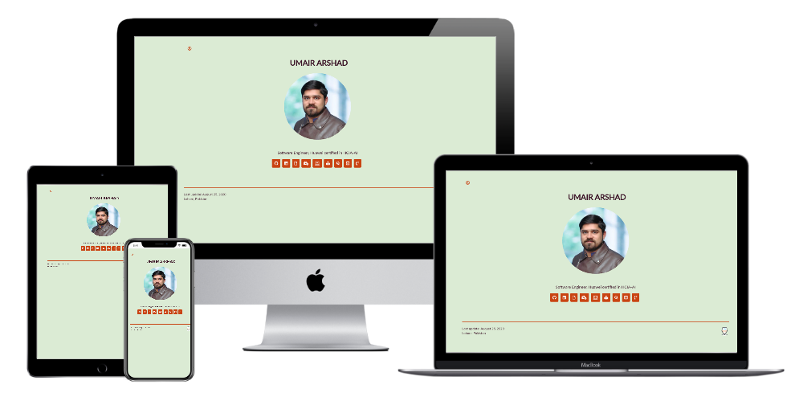

<h3 align="center">Portfolio</h3>

## Built With

- HTML5
- CSS3
- JavaScript
- Bootstrap

## Live Demo

To see a preview of the actual project, check out the [Live Demo Link](https://umairarshadbutt.github.io/)

## Getting Started

To get a local copy up and running follow these simple example steps.

### Prerequisites
To run the project smoothly, you must have the following installed on your machine:

- Git
- A web browser.

### Setup
You need to clone the project by running `https://github.com/umairarshadbutt/umairarshadbutt.github.io.git` You'd then navigate to the location to which you cloned the project and run the `index.html` file on your browser.

## Authors

👤 **Umair Arshad**

- Github: [@umairarshadbutt](https://github.com/umairarshadbutt)
- Twitter: [@its_UmairArshad](https://twitter.com/its_UmairArshad)
- Linkedin: [umair-arshad-butt](https://www.linkedin.com/in/umair-arshad-butt/)

## 🤝 Contributing

Contributions, issues and feature requests are welcome! Start by:

- Forking the project
- Cloning the project to your local machine
- `cd` into the project directory
- Run `git checkout -b your-branch-name`
- Make your contributions
- Push your branch up to your forked repository
- Open a Pull Request with a detailed description to the development branch of the original project for a review

## Show your support

Give a ⭐️ if you like this project!

## Acknowledgments

- Project inspired by Hackerrank

## 📝 License

This project is [MIT](LICENSE) licensed.
